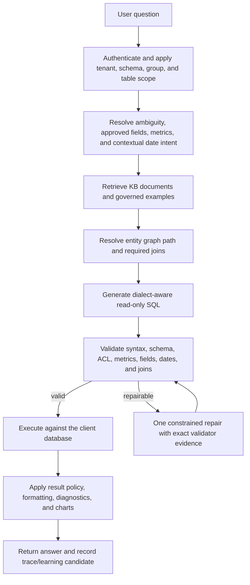

# QueryBot v2

QueryBot is a multi-tenant, governed natural-language analytics platform for enterprise databases. Business users ask questions in plain English; QueryBot resolves approved business semantics and join paths, generates database-aware read-only SQL, validates it, executes it, and returns a business-readable result with diagnostics and visualizations.

The product includes an administrator workspace for onboarding, Knowledge Base generation, semantic modeling, metrics, entity relationships, date roles, access control, compliance, evaluation, observability, and governed learning.

> **Readiness note:** QueryBot is a production-oriented application with substantial governance and test coverage. It is not a substitute for client-specific security review, semantic-model approval, load testing, disaster-recovery testing, or regulatory certification. Regulated-industry controls must be configured and validated for each deployment.

## Contents

- [Product capabilities](#product-capabilities)
- [How a question is answered](#how-a-question-is-answered)
- [Knowledge and semantic model](#knowledge-and-semantic-model)
- [Governance and privacy](#governance-and-privacy)
- [Architecture](#architecture)
- [Quick start](#quick-start)
- [Initial configuration](#initial-configuration)
- [Testing](#testing)
- [Operations](#operations)
- [Project structure](#project-structure)
- [Current boundaries](#current-boundaries)

## Product capabilities

### Governed natural-language to SQL

- Web portal, Microsoft Teams, Zoom, and Slack entry points.
- Tenant, user, group, table, and schema-aware query scope.
- Azure OpenAI, OpenAI, and Anthropic model providers, with system defaults and per-client overrides.
- Database-dialect-aware prompt rules and SQL validation.
- Read-only SQL enforcement, exact table and column validation, ACL checks, and structured repair feedback.
- Support for aggregations, rankings, top-N, period comparisons, running totals, contribution analysis, anti-joins, and multi-step CTE queries.
- Guardrails for fact-to-fact joins, table grain, approved metrics, semantic field sources, and entity-graph relationships.
- One controlled SQL repair attempt when a generated query fails validation or execution.

### Knowledge Base and retrieval

- Schema discovery with tables, columns, types, primary keys, foreign keys, and sample-value controls.
- ERP naming enrichment and optional terminology packs for cryptic warehouse fields.
- Human-readable Markdown KB documents plus machine-readable JSON/YAML semantic artifacts.
- Qdrant vector retrieval combined with BM25 keyword retrieval and document-quality ranking.
- Table-coverage gap filling when retrieval misses a required table.
- KB quality reporting for unconfirmed grain, weak field meanings, missing display dimensions, unconnected facts, and unapproved relationships.
- Admin edits and approved semantic corrections are preserved across rebuilds and re-embedded.

### Semantic layer and metrics

- User-submitted field corrections with administrator review and approval.
- Approved field meanings and use cases enforced during SQL generation and validation.
- Governed metric formulas, result formats, filters, allowed dimensions, synonyms, and example questions.
- Row-level calculated metrics with aggregation, required columns, and required joins.
- Metric formula enforcement prevents the model from silently substituting a nearby measure.
- Currency, percentage, numeric, and other result formatting metadata flows into the portal result renderer.

### Entity graph and join governance

- Imports database PK/FK metadata as relationship candidates.
- Supports composite joins and multiple role-playing relationships between the same pair of tables.
- Admins can add, edit, validate, probe, approve, or disable relationships.
- Join direction, join type, cardinality, confidence, source, and validation status are retained.
- The graph resolver selects an approved path; the validator checks that generated SQL follows the governed path.
- Graph health and relationship diagnostics expose weak or untested model areas before users encounter them.

### Contextual and role-playing dates

QueryBot supports facts that reuse one date dimension through several keys, for example:

- `ORDER_DT_DMS_KEY -> DT_DMS.DT_DMS_KEY`
- `BOOKED_DT_DMS_KEY -> DT_DMS.DT_DMS_KEY`
- `PAY_DT_DMS_KEY -> DT_DMS.DT_DMS_KEY`

Date bindings record the business role, fact key, dimension key, display date, key representation, aliases, priority, and default status. A metric can therefore use the same revenue expression with different business date contexts such as booked revenue, ordered revenue, invoiced revenue, or daily sales.

Surrogate date IDs are distinguished from native dates, timestamps, and `YYYYMMDD` keys. The validator blocks unsafe attempts to parse a surrogate ID as a calendar date and requires the appropriate date-dimension join instead.

### Business results and analytical UX

- Business-readable result summaries, confidence evidence, and query-production details.
- Structured zero-row root-cause hints rather than a generic empty result.
- Result tables, CSV export, charts, contribution views, follow-up questions, and result follow-ups through DuckDB.
- Chart selection based on result shape and question intent, with user-selectable chart styles and palettes.
- Personal dashboards with live, movable pinned charts.
- Statistical signals for ranking gaps, concentration, trends, variance, outliers, contribution, and cross-metric divergence.

### Evaluation, learning, and observability

- End-to-end traces from question, retrieval, semantic plan, graph plan, SQL validation, execution, and response.
- Per-component timings, confidence factors, repair counts, and sanitized LLM audit records.
- Golden-question evaluation suites and regression checks per client/schema.
- Thumbs-up/down answer feedback with structured reasons.
- Successful and failed answers become review candidates, not automatic training data.
- Only administrator-approved positive examples and negative avoidance rules enter governed retrieval.
- Governed examples are retrieved as patterns for future generation; QueryBot still validates and executes newly generated SQL rather than blindly replaying stored SQL.
- Suggestion ranking can learn from impressions, clicks, executions, outcomes, role relevance, and approved examples.

## How a question is answered



The LLM does not connect directly to a client database. The backend supplies governed schema context, executes validated SQL, and controls which result-derived information may be used for narration or follow-up features.

## Knowledge and semantic model

The KB is intentionally more than a collection of embeddings. It combines several governed sources:

| Layer | Purpose |
|---|---|
| Physical schema | Exact databases, schemas, tables, columns, types, PKs, and FKs |
| Enriched KB | Table purpose, field meaning, ERP abbreviation expansion, examples, and query patterns |
| Structured semantic model | Grain, dimensions, measures, display fields, date roles, filters, and relationship candidates |
| Approved semantic overrides | Administrator-approved field meanings and business use cases |
| Metric registry | Canonical formulas, filters, formats, dimensions, and required joins |
| Entity graph | Governed relationship paths and join conditions |
| Contextual dates | Metric-specific and default business-date bindings |
| Governed examples | Approved positive patterns and negative avoidance rules |

### Recommended onboarding sequence

1. Register the client and assign its database.
2. Select an industry/compliance profile and optional ERP terminology packs.
3. Discover the selected schemas and tables.
4. Review masking and data-egress previews before KB generation.
5. Build the KB and inspect its quality report.
6. Confirm fact grain, display dimensions, field meanings, and date roles.
7. Validate entity relationships against the live database.
8. Create or approve the business metrics needed for the demonstration or rollout.
9. Add users/groups and restrict table access.
10. Run a client-specific golden-question suite before enabling broad self-service.

## Governance and privacy

### Scope and access controls

- Every query is scoped by `account_id` and the authenticated user's permitted schemas/tables.
- Portal schema selection narrows retrieval, semantic planning, generation, and validation together.
- Group and per-user table permissions are enforced before execution.
- Qdrant payloads and governed examples are filtered by account and accessible schema/table scope.

### Sensitive-data controls

- Schema-time classification identifies common PII, PHI, financial, payment, prescription, credential, and free-text risks.
- KB samples can be redacted, replaced with synthetic values, tokenized, partially masked, or omitted.
- Optional local NER strengthens person-name removal from free text without sending it to an external service.
- Result release policies support redaction, stable safe aliases, partial display, tokenization, and nulling.
- User-typed PII is scrubbed before LLM prompts for regulated tenants.
- Regulated profiles can block result-derived LLM calls while still allowing the model to produce SQL from governed metadata.
- Per-user attestations may allow controlled unmasked result release; each release is written to the decision log.

### Regulated-industry workflow

Banking and healthcare/pharmacy packs provide conservative classifications and policy templates. Activation is gated by readiness checks such as classification review, policy configuration, purposes, provider agreements where required, and identity controls.

These controls are implementation safeguards, not a claim of HIPAA, PCI DSS, SOC 2, or other certification. The deploying organization remains responsible for legal review, provider agreements, identity architecture, retention, monitoring, and operational controls.

## Architecture

| Component | Technology | Responsibility |
|---|---|---|
| Application | FastAPI, Starlette, Jinja2 | Admin portal, user portal, APIs, webhooks, WebSockets |
| Query pipeline | Python | Scoping, retrieval, planning, generation, validation, execution, response |
| SQL parser/validator | sqlglot | Dialect parsing, structural checks, schema/semantic enforcement |
| Result follow-ups | DuckDB | Controlled calculations over cached query results |
| Vector retrieval | Qdrant | Tenant-scoped KB and governed-memory retrieval |
| Keyword retrieval | BM25 | Exact field, acronym, and business-term matching |
| Metadata store | SQLite or PostgreSQL | Tenants, users, metrics, graph, traces, policies, learning state |
| Client databases | Snowflake, Oracle, Azure SQL | Read-only business-data queries |
| LLM providers | Azure OpenAI, OpenAI, Anthropic | SQL generation and permitted language tasks |

See [ARCHITECTURE.md](ARCHITECTURE.md) for module-level behavior and [ARCHITECTURE_VISUAL.html](ARCHITECTURE_VISUAL.html) for the interactive diagrams. Some older sections in those deep-dive documents may lag the implementation; the code and tests remain authoritative.

## Quick start

### Prerequisites

- Python 3.12 recommended.
- A reachable Qdrant service.
- SQLite for local evaluation, or PostgreSQL for concurrent production-oriented workloads.
- Native database drivers for the client database. Azure SQL requires Microsoft ODBC Driver 18 for SQL Server.
- Credentials for one supported LLM provider.

### Local development

```powershell
git clone https://github.com/sud-sn/Querybot_v2.git
cd Querybot_v2
py -3.12 -m venv venv
.\venv\Scripts\Activate.ps1
python -m pip install --upgrade pip
python -m pip install -r requirements-windows.txt
Copy-Item .env.windows.example .env
```

On Linux/macOS:

```bash
git clone https://github.com/sud-sn/Querybot_v2.git
cd Querybot_v2
python3 -m venv venv
source venv/bin/activate
python -m pip install --upgrade pip
python -m pip install -r requirements.txt
cp .env.example .env
```

Configure `.env`, start Qdrant, and then run:

```bash
python -m uvicorn main:app --host 0.0.0.0 --port 8000
```

Open:

- Admin portal: `http://127.0.0.1:8000/admin`
- User portal: `http://127.0.0.1:8000/portal`
- Health endpoint: `http://127.0.0.1:8000/health`

### Qdrant

For local Docker:

```bash
docker compose -f deploy/qdrant.compose.yml up -d
```

Set `QDRANT_URL` and, for a secured/cloud deployment, `QDRANT_API_KEY`. Do not expose Qdrant publicly without authentication and network controls.

### Azure Windows VM

Use the maintained Windows runbooks rather than adapting Linux commands:

- [Azure Windows VM overview](deploy/windows/README.md)
- [Copy-paste installation guide](deploy/windows/STEP-BY-STEP.md)
- `deploy/windows/install-querybot.ps1`
- `deploy/windows/start-querybot.ps1`
- `deploy/windows/verify-querybot.ps1`

For durable production deployments, prefer managed PostgreSQL and Qdrant Cloud or a private Linux Qdrant host. WSL/Docker is suitable for a POC but should not be assumed to provide production backup and recovery.

## Initial configuration

### Environment

The application reads infrastructure secrets from `.env`. Provider API keys and client database credentials can also be configured through the admin UI and are encrypted at rest using the QueryBot key file.

Important settings include:

| Variable | Purpose |
|---|---|
| `DATABASE_URL` | PostgreSQL metadata-store URL; omit to use SQLite |
| `DB_PATH` | SQLite metadata-store path |
| `QDRANT_URL` | Qdrant endpoint |
| `QDRANT_API_KEY` | Optional Qdrant authentication key |
| `SESSION_SECRET` | General session-signing secret |
| `PORTAL_SESSION_SECRET` | Portal session-signing secret |
| `ADMIN_SESSION_SECRET` | Admin session-signing secret |
| `PII_PSEUDONYM_SECRET` | Stable secret used for governed result aliases |
| `QUERYBOT_KEY_FILE` | External credential-encryption key path |
| `PORTAL_BASE_URL` | Public HTTPS base URL used in generated links |

Never deploy with the example `CHANGE_ME` values or the development fallback secrets. Keep the encryption key outside the repository and include it in protected backup/recovery procedures.

### Admin setup

1. Open **System** and choose the default LLM provider/model.
2. Save credentials, test the provider connection, and select deployments where applicable.
3. Configure PostgreSQL for shared/concurrent usage and verify Qdrant health.
4. Add a client database and test the connection.
5. Register a client and complete the onboarding sequence described above.

## Testing

Run the complete suite:

```bash
python -m pytest -q
```

High-value focused suites include:

```bash
python -m pytest -q tests/test_sql_reliability.py
python -m pytest -q tests/test_entity_graph.py tests/test_graph_governance.py
python -m pytest -q tests/test_contextual_dates.py tests/test_date_roles.py
python -m pytest -q tests/test_metric_builder.py tests/test_metric_scope.py
python -m pytest -q tests/test_semantic_layer.py tests/test_semantic_contract.py
python -m pytest -q tests/test_compliance_engine.py tests/test_regulated_llm_boundary.py
python -m pytest -q tests/test_learning_loop_integration.py
python -m pytest -q tests/test_production_ui.py
```

Tests use isolated fixtures and must not require a production client database. Live database validation, query-plan review, concurrency/load testing, and recovery exercises remain deployment responsibilities.

## Operations

### What to inspect when an answer is wrong

1. Open the answer trace and inspect schema scope, retrieved KB documents, metric/date bindings, graph plan, validator result, and repair history.
2. Confirm the business field in the Semantic Layer.
3. Confirm the metric formula, filters, result format, and contextual date binding.
4. Validate the entity relationship and cardinality against the source database.
5. Add the question to the client's golden evaluation suite.
6. Correct or reject the learning candidate; do not promote an answer only because it executed successfully.

### Production checklist

- Use PostgreSQL rather than SQLite for concurrent multi-user workloads.
- Use HTTPS behind a reverse proxy or application gateway; do not expose Uvicorn directly.
- Set unique session, pseudonym, and encryption secrets.
- Restrict Qdrant, PostgreSQL, and database ports to private networks.
- Use a read-only client database principal with least privilege.
- Pin and stage-test dependency/container versions.
- Configure backups for PostgreSQL, Qdrant, the QueryBot key file, and client KB artifacts.
- Configure centralized logs, alerts, retention, and incident procedures.
- Run golden regressions after schema, metric, field, graph, date-role, model, or prompt changes.
- Validate regulated profiles, provider agreements, identity/MFA, and result-release policy before activation.

See [ROLLOUT.md](ROLLOUT.md) for staged feature rollout guidance.

## Project structure

```text
admin/                  Administrator routes, templates, and workflows
core/                   Query, semantic, retrieval, validation, analytics, and compliance logic
core/compliance/        Classification, policy, SQL/result guards, and readiness checks
gateway/                Teams, Zoom, Slack, and web event adapters
portal/                 User portal routes and templates
store/                  SQLite/PostgreSQL persistence and repositories
static/                 Shared visual tokens and frontend assets
packs/                  ERP terminology and industry vocabulary packs
evals/                  Golden evaluation definitions
tests/                  Unit, integration, architecture, UI, and regression tests
deploy/                 Qdrant and operating-system deployment assets
main.py                 FastAPI application composition and lifecycle
```

Primary implementation entry points:

| File | Responsibility |
|---|---|
| `core/query_pipeline.py` | End-to-end query orchestration |
| `core/llm.py` | Provider resolution and SQL-generation prompts |
| `core/validator.py` | SQL, schema, ACL, and semantic validation |
| `core/semantic_planner.py` | Approved field and metric planning |
| `core/graph_resolver.py` | Governed join-path resolution |
| `core/contextual_dates.py` | Metric-aware date-context resolution |
| `core/semantic_model.py` | Structured semantic artifacts |
| `core/knowledge.py` | KB retrieval and ranking |
| `core/masking.py` | KB sample masking and synthetic replacement |
| `core/compliance/` | Regulated query and result policy boundary |
| `core/pipeline_trace.py` | Trace and learning-candidate lifecycle |
| `core/result_renderer.py` | Business result rendering |

## Current boundaries

- Semantic correctness still depends on administrator-approved field meanings, metric definitions, fact grain, relationships, and date roles. No LLM can infer every client-specific rule reliably from cryptic schema names alone.
- Query optimization is guarded and dialect-aware, but generated SQL should not be assumed optimal for every data volume, index strategy, warehouse, or workload. Validate expensive golden queries with the target database's execution plan.
- SQLite is convenient for demos and single-user evaluation; use PostgreSQL for production-oriented concurrency.
- Qdrant and the metadata database require explicit backup, restore, monitoring, and capacity planning.
- Learning is governed retrieval, not autonomous model training. Only approved memories should influence future generation.
- Compliance features reduce risk but do not independently establish regulatory compliance.

## License and support

No open-source license is declared in this repository. Treat the code as proprietary unless the repository owner provides separate licensing terms.

For implementation details, begin with [ARCHITECTURE.md](ARCHITECTURE.md), and use the admin trace, KB quality, model health, and evaluation pages as the operational source of truth.
