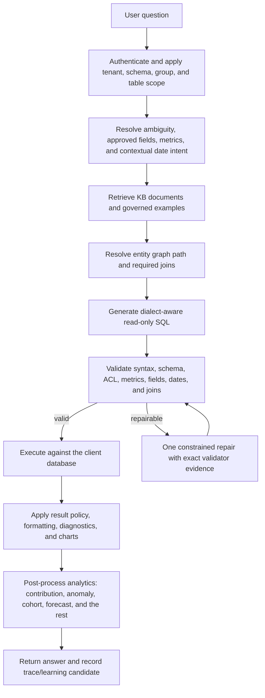

# QueryBot v2

QueryBot is a multi-tenant, governed natural-language analytics platform for enterprise databases. Business users ask questions in plain English or French; QueryBot resolves approved business semantics and join paths, generates database-aware read-only SQL, validates it, executes it, and returns a business-readable result with a computed summary, an analyst's explanation, diagnostics, and visualizations.

The product includes an administrator workspace for onboarding, Knowledge Base generation, semantic modeling, metrics, entity relationships, date roles, access control, compliance, evaluation, observability, and governed learning.

> **Readiness note:** QueryBot is a production-oriented application with substantial governance and test coverage. It is not a substitute for client-specific security review, semantic-model approval, load testing, disaster-recovery testing, or regulatory certification. Regulated-industry controls must be configured and validated for each deployment.

## Contents

- [Product capabilities](#product-capabilities)
- [How a question is answered](#how-a-question-is-answered)
- [Knowledge and semantic model](#knowledge-and-semantic-model)
- [Governance and privacy](#governance-and-privacy)
- [Architecture](#architecture)
- [Quick start](#quick-start)
- [Initial configuration](#initial-configuration)
- [Testing](#testing)
- [Operations](#operations)
- [Project structure](#project-structure)
- [Current boundaries](#current-boundaries)

## Product capabilities

### Governed natural-language to SQL

- Web portal, Microsoft Teams, Zoom, and Slack entry points.
- Tenant, user, group, table, and schema-aware query scope.
- Azure OpenAI, OpenAI, and Anthropic model providers, with system defaults and per-client overrides. For Azure OpenAI the endpoint is normalised from whatever form was pasted (resource URL, full chat-completions URL, or a Foundry project URL), the deployment name is resolved rather than guessed from a model id, SQL is generated at temperature 0, and content-filter rejections, empty responses, and rate limits are read as what they are instead of as blank SQL.
- Database-dialect-aware prompt rules and SQL validation.
- Read-only SQL enforcement, exact table and column validation, ACL checks, and structured repair feedback.
- Support for aggregations, rankings, top-N, period comparisons, running totals, contribution analysis, anti-joins, and multi-step CTE queries.
- Guardrails for fact-to-fact joins, table grain, approved metrics, semantic field sources, and entity-graph relationships.
- One controlled SQL repair attempt when a generated query fails validation or execution.

### Languages

- The portal, the answer card, clarifications, refusals, and follow-up chips are available in English and French. Each user's language is chosen in the portal and remembered on their account.
- A French question is canonicalised into the English the deterministic detectors read (periods, top-N, comparisons, causal and analytical wording) before planning, so "les 5 meilleurs clients de l'année dernière" reaches the same planner as its English form. The reader's own words are still what the model sees and what retrieval and value resolution use.
- Every computed sentence comes from one message catalogue with an English and a French value, including number formatting (a non-breaking thin space and a decimal comma in French). Model-written prose is written in the reader's language through a rule in the prompt; column names and category values from the client's database are quoted as they are.
- `python -m evals.emco_rehearsal` drives a client's demo questions through the real pipeline stages in both languages without a warehouse and reports each stage's decision, so a question that quietly answers something else is visible before a demo rather than during it.

### Knowledge Base and retrieval

- Schema discovery with tables, columns, types, primary keys, foreign keys, and sample-value controls.
- ERP naming enrichment and optional terminology packs for cryptic warehouse fields.
- Human-readable Markdown KB documents plus machine-readable JSON/YAML semantic artifacts.
- Qdrant vector retrieval combined with BM25 keyword retrieval and document-quality ranking.
- Table-coverage gap filling when retrieval misses a required table.
- KB quality reporting for unconfirmed grain, weak field meanings, missing display dimensions, unconnected facts, and unapproved relationships.
- Admin edits and approved semantic corrections are preserved across rebuilds and re-embedded.
- A KB build survives its provider: a content-filter rejection skips that one table's request rather than the build, a rate limit is waited out with the build's stop button still honoured, and the token budget for a wide fact table grows in steps instead of failing at a fixed ceiling.

### Semantic layer and metrics

- User-submitted field corrections with administrator review and approval.
- Approved field meanings and use cases enforced during SQL generation and validation.
- Governed metric formulas, result formats, filters, allowed dimensions, synonyms, and example questions.
- Row-level calculated metrics with aggregation, required columns, and required joins.
- Ratio metrics (`X per Y`) compile to a null-guarded division, so "revenue per active customer" is a structured definition rather than hand-written SQL.
- Metric formula enforcement prevents the model from silently substituting a nearby measure.
- Currency, percentage, numeric, and other result formatting metadata flows into the portal result renderer.

**Describing a calculation in chat.** A user who knows the data can state a
calculation in plain English — which table, which fields, what to divide by —
and get an answer from it immediately. Two tracks run from one turn:

- The composed definition is validated, dry-run against the live database, and pinned to that conversation thread, so the question is answered now and follow-ups ("now break that down by region") keep using it.
- Separately, a proposal is raised for an administrator to promote it into the shared metric registry. Nothing a chat handler composes becomes a governed metric on its own.

The model never writes SQL for this. It fills structured slots that reference
tables and columns by opaque reference, and the formula is compiled locally by
the metric builder, so injected SQL text cannot reach a formula through either
side of a ratio. Access control is applied before the planner prompt is built,
and a table revoked mid-thread invalidates a live draft on the next turn.

### Entity graph and join governance

- Imports database PK/FK metadata as relationship candidates.
- Supports composite joins and multiple role-playing relationships between the same pair of tables.
- Admins can add, edit, validate, probe, approve, or disable relationships.
- Join direction, join type, cardinality, confidence, source, and validation status are retained.
- The graph resolver selects an approved path; the validator checks that generated SQL follows the governed path.
- A question over two or more facts ("net sales and returns by warehouse") treats every fact as a root, never as a destination reached through a shared dimension. Each fact is planned to the requested grain on its own edge, the facts are aggregated in isolation and joined only on the dimensions they share, and a grain reached through a snowflake hop counts. Direct fact-to-fact joins are refused; a fact that cannot reach the requested grain blocks the plan with that fact named.
- Graph health and relationship diagnostics expose weak or untested model areas before users encounter them.

### Contextual and role-playing dates

QueryBot supports facts that reuse one date dimension through several keys, for example:

- `ORDER_DT_DMS_KEY -> DT_DMS.DT_DMS_KEY`
- `BOOKED_DT_DMS_KEY -> DT_DMS.DT_DMS_KEY`
- `PAY_DT_DMS_KEY -> DT_DMS.DT_DMS_KEY`

Date bindings record the business role, fact key, dimension key, display date, key representation, aliases, priority, and default status. A metric can therefore use the same revenue expression with different business date contexts such as booked revenue, ordered revenue, invoiced revenue, or daily sales.

Surrogate date IDs are distinguished from native dates, timestamps, and `YYYYMMDD` keys. The validator blocks unsafe attempts to parse a surrogate ID as a calendar date and requires the appropriate date-dimension join instead.

### Business results and analytical UX

- Every answer card carries a computed summary written from the result itself, with no model call: a headline, the leader and its share or the trend and its peak, a decision signal (concentration, dominance, spread, growth, decline), and anomaly callouts. A ranking with two measures narrates both. A listing of records (invoice lines, order headers) is described as records and what they add up to, not as a race between them.
- After the card, an analyst's explanation of the result arrives as a second message in the reader's language. It is written from a statistical brief of the result, never from the rows, and it is delivered as a second message so the factual answer is never held up by it. It follows every answer by default; the per-client setting **Analyst explanation** can restrict it to questions that ask for analysis or a cause. Causal questions ("why did sales drop in March") additionally run governed drill-down queries.
- A claim about the whole needs the whole. When a result was cut by a `TOP`, a row cap, or a filter, the trend sentence, the decision signal, median and quartiles are withheld rather than computed over the slice, and the card's badge says what came back: full distribution, top N only, full series, first N periods only, preview, or filtered subset. A default `TOP` that never bound is not a truncation.
- The reader can talk to a result instead of only commanding it: filter, aggregate, sort, keep the top N, exclude, chart and compare are understood as commands, and anything else ("what is the total?", "why is that?", "what does this column mean?") is answered by the model from the same brief, with the reader's own words the last thing it reads.
- Business-readable provenance, confidence evidence, and query-production details, in the tenant's own vocabulary rather than raw table and column codes.
- Structured zero-row root-cause hints rather than a generic empty result.
- Result tables, CSV export, charts, contribution views, follow-up questions, and result follow-ups through DuckDB.
- Chart selection based on result shape and question intent, with user-selectable chart styles and palettes.
- Personal dashboards with live, movable pinned charts.
- Statistical signals for ranking gaps, concentration, trends, variance, outliers, contribution, and cross-metric divergence.

**Forecasting.** A projection is offered only when the series can support one,
and every projection carries a 95% prediction interval — shown as a band on the
chart and as `forecast_low` / `forecast_high` on the rows. A number without an
interval is a claim; the band is what makes it a forecast.

A forecast is refused, rather than drawn, when the result is truncated, masked,
out of order, irregularly spaced, too short, constant, has no real time axis,
holds more than one series, or when the fit fails both an R-squared and an
out-of-sample backtest. Each refusal names its own threshold — *"I did not
project future periods: this series has 2 years and a reliable projection needs
at least 6"* — because "I could not forecast that" is only useful if it also
says what would make it possible.

Model selection follows the length and seasonality of the series: ordinary least
squares under 12 points, damped-trend exponential smoothing above it, and
seasonal SARIMAX only where there are two full cycles plus room and a real
autocorrelation at the seasonal lag. If a model is unavailable or will not
converge, the fit falls back down that ladder and says so; a missing library is
never a reason to refuse a user a forecast.

### Evaluation, learning, and observability

- End-to-end traces from question, retrieval, semantic plan, graph plan, SQL validation, execution, and response.
- Per-component timings, confidence factors, repair counts, and sanitized LLM audit records.
- Golden-question evaluation suites and regression checks per client/schema.
- Thumbs-up/down answer feedback with structured reasons.
- Successful and failed answers become review candidates, not automatic training data.
- Only administrator-approved positive examples and negative avoidance rules enter governed retrieval.
- Governed examples are retrieved as patterns for future generation; QueryBot still validates and executes newly generated SQL rather than blindly replaying stored SQL.
- Suggestion ranking can learn from impressions, clicks, executions, outcomes, role relevance, and approved examples.

## How a question is answered


```mermaid
flowchart TD
    A["User question"] --> B["Authenticate and apply tenant, schema, group, and table scope"]
    B --> C["Resolve ambiguity, approved fields, metrics, and contextual date intent"]
    C --> D["Retrieve KB documents and governed examples"]
    D --> E["Resolve entity graph path and required joins"]
    E --> F["Generate dialect-aware read-only SQL"]
    F --> G["Validate syntax, schema, ACL, metrics, fields, dates, and joins"]
    G -->|valid| H["Execute against the client database"]
    G -->|repairable| I["One constrained repair with exact validator evidence"]
    I --> G
    H --> J["Apply result policy, formatting, diagnostics, and charts"]
    J --> L["Post-process analytics: contribution, anomaly, cohort, forecast, and the rest"]
    L --> K["Return answer and record trace/learning candidate"]
```

Post-processing runs after execution and before the answer is sent. Each
analytic decides for itself whether the result can support it — statistics over
a truncated result, a forecast over a masked or unordered series, and a
distribution over a partial one are refused rather than computed, and the
refusal says so in the answer.

The LLM does not connect directly to a client database. The backend supplies governed schema context, executes validated SQL, and controls which result-derived information may be used for narration or follow-up features.

## Knowledge and semantic model

The KB is intentionally more than a collection of embeddings. It combines several governed sources:

| Layer | Purpose |
|---|---|
| Physical schema | Exact databases, schemas, tables, columns, types, PKs, and FKs |
| Enriched KB | Table purpose, field meaning, ERP abbreviation expansion, examples, and query patterns |
| Structured semantic model | Grain, dimensions, measures, display fields, date roles, filters, and relationship candidates |
| Approved semantic overrides | Administrator-approved field meanings and business use cases |
| Metric registry | Canonical formulas, filters, formats, dimensions, and required joins |
| Entity graph | Governed relationship paths and join conditions |
| Contextual dates | Metric-specific and default business-date bindings |
| Governed examples | Approved positive patterns and negative avoidance rules |

### Recommended onboarding sequence

1. Register the client and assign its database.
2. Select an industry/compliance profile and optional ERP terminology packs.
3. Discover the selected schemas and tables.
4. Review masking and data-egress previews before KB generation.
5. Build the KB and inspect its quality report.
6. Confirm fact grain, display dimensions, field meanings, and date roles.
7. Validate entity relationships against the live database.
8. Create or approve the business metrics needed for the demonstration or rollout.
9. Add users/groups and restrict table access.
10. Run a client-specific golden-question suite before enabling broad self-service.

## Governance and privacy

### Scope and access controls

- Every query is scoped by `account_id` and the authenticated user's permitted schemas/tables.
- Portal schema selection narrows retrieval, semantic planning, generation, and validation together.
- Group and per-user table permissions are enforced before execution.
- Qdrant payloads and governed examples are filtered by account and accessible schema/table scope.
- No chat handler promotes anything into the governed model. Conversational surfaces may compose a definition, validate it, and use it for the asking user's own thread, but only a human accept route writes to the registry and triggers a semantic recompile. This holds for the entity-graph chat and for metric authoring alike, and is asserted by tests rather than left to convention.

### Sensitive-data controls

- Schema-time classification identifies common PII, PHI, financial, payment, prescription, credential, and free-text risks.
- KB samples can be redacted, replaced with synthetic values, tokenized, partially masked, or omitted.
- Optional local NER strengthens person-name removal from free text without sending it to an external service.
- Result release policies support redaction, stable safe aliases, partial display, tokenization, and nulling.
- User-typed PII is scrubbed before LLM prompts for regulated tenants.
- Regulated profiles can block result-derived LLM calls while still allowing the model to produce SQL from governed metadata.
- Per-user attestations may allow controlled unmasked result release; each release is written to the decision log.

### Regulated-industry workflow

Banking and healthcare/pharmacy packs provide conservative classifications and policy templates. Activation is gated by readiness checks such as classification review, policy configuration, purposes, provider agreements where required, and identity controls.

These controls are implementation safeguards, not a claim of HIPAA, PCI DSS, SOC 2, or other certification. The deploying organization remains responsible for legal review, provider agreements, identity architecture, retention, monitoring, and operational controls.

## Architecture

| Component | Technology | Responsibility |
|---|---|---|
| Application | FastAPI, Starlette, Jinja2 | Admin portal, user portal, APIs, webhooks, WebSockets |
| Query pipeline | Python | Scoping, retrieval, planning, generation, validation, execution, response |
| SQL parser/validator | sqlglot | Dialect parsing, structural checks, schema/semantic enforcement |
| Result follow-ups | DuckDB | Controlled calculations over cached query results |
| Vector retrieval | Qdrant | Tenant-scoped KB and governed-memory retrieval |
| Keyword retrieval | BM25 | Exact field, acronym, and business-term matching |
| Metadata store | SQLite or PostgreSQL | Tenants, users, metrics, graph, traces, policies, learning state |
| Client databases | Snowflake, Oracle, Azure SQL | Read-only business-data queries |
| LLM providers | Azure OpenAI, OpenAI, Anthropic | SQL generation and permitted language tasks |

See [ARCHITECTURE.md](ARCHITECTURE.md) for module-level behavior and [ARCHITECTURE_VISUAL.html](ARCHITECTURE_VISUAL.html) for the interactive diagrams. Some older sections in those deep-dive documents may lag the implementation; the code and tests remain authoritative.

## Quick start

### Prerequisites

- Python 3.12 recommended; 3.11 and 3.14 are also verified to install cleanly.
- `pip install -r requirements.txt` pulls statsmodels (and scipy/pandas with it) for the seasonal and exponential-smoothing forecast models — roughly 60MB of wheels. Forecasting still works without them: the models load through a guarded lazy import and fall back to pure-Python least squares, prediction intervals included. Both configurations are covered by tests.
- A reachable Qdrant service.
- SQLite for local evaluation, or PostgreSQL for concurrent production-oriented workloads.
- Native database drivers for the client database. Azure SQL requires Microsoft ODBC Driver 18 for SQL Server.
- Credentials for one supported LLM provider.

### Local development

```powershell
git clone https://github.com/sud-sn/Querybot_v2.git
cd Querybot_v2
py -3.12 -m venv venv
.\venv\Scripts\Activate.ps1
python -m pip install --upgrade pip
python -m pip install -r requirements-windows.txt
Copy-Item .env.windows.example .env
```

On Linux/macOS:

```bash
git clone https://github.com/sud-sn/Querybot_v2.git
cd Querybot_v2
python3 -m venv venv
source venv/bin/activate
python -m pip install --upgrade pip
python -m pip install -r requirements.txt
cp .env.example .env
```

Configure `.env`, start Qdrant, and then run:

```bash
python -m uvicorn main:app --host 0.0.0.0 --port 8000
```

Open:

- Admin portal: `http://127.0.0.1:8000/admin`
- User portal: `http://127.0.0.1:8000/portal`
- Health endpoint: `http://127.0.0.1:8000/health`

### Qdrant

For local Docker:

```bash
docker compose -f deploy/qdrant.compose.yml up -d
```

Set `QDRANT_URL` and, for a secured/cloud deployment, `QDRANT_API_KEY`. Do not expose Qdrant publicly without authentication and network controls.

### Azure Windows VM

Use the maintained Windows runbooks rather than adapting Linux commands:

- [Azure Windows VM overview](deploy/windows/README.md)
- [Copy-paste installation guide](deploy/windows/STEP-BY-STEP.md)
- `deploy/windows/install-querybot.ps1`
- `deploy/windows/start-querybot.ps1`
- `deploy/windows/verify-querybot.ps1`

For durable production deployments, prefer managed PostgreSQL and Qdrant Cloud or a private Linux Qdrant host. WSL/Docker is suitable for a POC but should not be assumed to provide production backup and recovery.

## Initial configuration

### Environment

The application reads infrastructure secrets from `.env`. Provider API keys and client database credentials can also be configured through the admin UI and are encrypted at rest using the QueryBot key file.

Important settings include:

| Variable | Purpose |
|---|---|
| `DATABASE_URL` | PostgreSQL metadata-store URL; omit to use SQLite |
| `DB_PATH` | SQLite metadata-store path |
| `QDRANT_URL` | Qdrant endpoint |
| `QDRANT_API_KEY` | Optional Qdrant authentication key |
| `SESSION_SECRET` | General session-signing secret |
| `PORTAL_SESSION_SECRET` | Portal session-signing secret |
| `ADMIN_SESSION_SECRET` | Admin session-signing secret |
| `PII_PSEUDONYM_SECRET` | Stable secret used for governed result aliases |
| `QUERYBOT_KEY_FILE` | External credential-encryption key path |
| `PORTAL_BASE_URL` | Public HTTPS base URL used in generated links |

Never deploy with the example `CHANGE_ME` values or the development fallback secrets. Keep the encryption key outside the repository and include it in protected backup/recovery procedures.

### Admin setup

1. Open **System** and choose the default LLM provider/model.
2. Save credentials, test the provider connection, and select deployments where applicable.
3. Configure PostgreSQL for shared/concurrent usage and verify Qdrant health.
4. Add a client database and test the connection.
5. Register a client and complete the onboarding sequence described above.
6. Complete the client's compliance setup and choose a posture. A client with no compliance profile is treated as regulated, which is fail-closed on purpose: the analyst's explanation, follow-up suggestions, and every other feature that shows the model a result are silently off until a posture is chosen.
7. Review the client's **Analyst explanation** setting (after every answer by default) and its LLM audit setting.

## Testing

Run the complete suite:

```bash
python -m pytest -q
```

The current baseline is **10990 passed, 9 skipped**. Treat any drop as a
regression rather than noise; the statistical suites are seeded and the coverage
bounds are set from measurement, not tuned to pass.

The demo rehearsal is a separate, faster check that runs the real pipeline
stages over a client's question set in both languages and compares every
stage's decision with the expected one:

```bash
python -m evals.emco_rehearsal
python -m evals.emco_rehearsal --lang fr --verbose
```

High-value focused suites include:

```bash
python -m pytest -q tests/test_sql_reliability.py
python -m pytest -q tests/test_entity_graph.py tests/test_graph_governance.py
python -m pytest -q tests/test_contextual_dates.py tests/test_date_roles.py
python -m pytest -q tests/test_metric_builder.py tests/test_metric_scope.py
python -m pytest -q tests/test_metric_foundations.py
python -m pytest -q tests/test_semantic_layer.py tests/test_semantic_contract.py
python -m pytest -q tests/test_compliance_engine.py tests/test_regulated_llm_boundary.py
python -m pytest -q tests/test_forecast_gate.py tests/test_forecast_models.py
python -m pytest -q tests/test_post_process_actually_runs.py
python -m pytest -q tests/test_learning_loop_integration.py
python -m pytest -q tests/test_production_ui.py
python -m pytest -q tests/test_each_fact_reaches_the_grain_by_its_own_edge.py tests/test_join_planner_v2.py
python -m pytest -q tests/test_the_analyst_writes_after_every_answer.py tests/test_analysis_reaches_the_reader.py
python -m pytest -q tests/test_a_limit_that_never_bit_is_not_a_truncation.py tests/test_claims_respect_a_truncated_result.py
python -m pytest -q tests/test_question_normalizer.py tests/test_a_french_reader_can_ask_for_analysis.py
```

Tests use isolated fixtures and must not require a production client database. Live database validation, query-plan review, concurrency/load testing, and recovery exercises remain deployment responsibilities.

**A note on what a test here is expected to do.** This repository has repeatedly
been bitten by assertions that read the source rather than run it — a check that
`evaluate_forecast_request` appears before `compute_forecast(` in a file passed
for a full release while the block it described raised `NameError` on every
call. Prefer tests that execute the path. Two patterns are in use for the cases
where that is hard:

- `tests/test_post_process_actually_runs.py` compiles a block out of the real pipeline file and executes it, and walks the bytecode of the query entry point for names that do not resolve — the interpreter's own analysis, not a grep.
- `tests/test_forecast_models.py` checks the prediction interval by drawing hundreds of series from a known process and counting how often the truth lands inside the band, rather than restating the formula in the assertion.

An assertion that accepts either outcome (`assert model in {"ets", "ols"}`)
tests nothing; one of those hid two broken model branches for a full commit.

Two further habits are now expected of a change here. First, a new test is
shown to fail before it is trusted: the defect is put back, or the fix is
mutated in the source, and the test goes red; a test that stays green through
that is decoration. Second, `tests/test_post_process_actually_runs.py` walks
every function in the repository for a local that is read before it can be
bound, including a function-local import that shadows a module import for the
rest of a long handler. That shape has silently killed a whole feature twice,
most recently for one commit during the work above, and the detector caught it
before it shipped.

## Operations

### What to inspect when an answer is wrong

1. Open the answer trace and inspect schema scope, retrieved KB documents, metric/date bindings, graph plan, validator result, and repair history.
2. Confirm the business field in the Semantic Layer.
3. Confirm the metric formula, filters, result format, and contextual date binding.
4. Validate the entity relationship and cardinality against the source database.
5. Add the question to the client's golden evaluation suite.
6. Correct or reject the learning candidate; do not promote an answer only because it executed successfully.

### Production checklist

- Use PostgreSQL rather than SQLite for concurrent multi-user workloads.
- Use HTTPS behind a reverse proxy or application gateway; do not expose Uvicorn directly.
- Set unique session, pseudonym, and encryption secrets.
- Restrict Qdrant, PostgreSQL, and database ports to private networks.
- Use a read-only client database principal with least privilege.
- Pin and stage-test dependency/container versions.
- Configure backups for PostgreSQL, Qdrant, the QueryBot key file, and client KB artifacts.
- Configure centralized logs, alerts, retention, and incident procedures.
- Run golden regressions after schema, metric, field, graph, date-role, model, or prompt changes.
- Validate regulated profiles, provider agreements, identity/MFA, and result-release policy before activation.

See [ROLLOUT.md](ROLLOUT.md) for staged feature rollout guidance.

## Project structure

```text
admin/                  Administrator routes, templates, and workflows
core/                   Query, semantic, retrieval, validation, analytics, and compliance logic
core/compliance/        Classification, policy, SQL/result guards, and readiness checks
gateway/                Teams, Zoom, Slack, and web event adapters
portal/                 User portal routes and templates
store/                  SQLite/PostgreSQL persistence and repositories
static/                 Shared visual tokens and frontend assets
packs/                  ERP terminology and industry vocabulary packs
evals/                  Golden evaluation definitions and the bilingual demo rehearsal harness
tests/                  Unit, integration, architecture, UI, and regression tests
deploy/                 Qdrant and operating-system deployment assets
main.py                 FastAPI application composition and lifecycle
```

Primary implementation entry points:

| File | Responsibility |
|---|---|
| `core/query_pipeline.py` | End-to-end query orchestration |
| `core/llm.py` | Provider resolution and SQL-generation prompts |
| `core/validator.py` | SQL, schema, ACL, and semantic validation |
| `core/semantic_planner.py` | Approved field and metric planning |
| `core/graph_resolver.py` | Governed join-path resolution, one root per fact |
| `core/join_planner.py` | Isolated aggregation and shared-grain planning across facts |
| `core/response_builder.py` | The answer card: computed summary, result scope, decision signal |
| `core/insight.py` | The statistical brief and the analyst's explanation |
| `core/analysis_narrative.py` | Evidence-checked phrasing, template or model, in either language |
| `core/result_conversation.py` | Talking to a result on screen |
| `core/question_normalizer.py` | French questions canonicalised for the deterministic detectors |
| `core/i18n.py` | The English and French message catalogue and number formatting |
| `core/contextual_dates.py` | Metric-aware date-context resolution |
| `core/semantic_model.py` | Structured semantic artifacts |
| `core/knowledge.py` | KB retrieval and ranking |
| `core/masking.py` | KB sample masking and synthetic replacement |
| `core/compliance/` | Regulated query and result policy boundary |
| `core/chart_policy.py` | Aggregate-only rule shared by charts and forecasts |
| `core/pipeline_trace.py` | Trace and learning-candidate lifecycle |
| `core/result_renderer.py` | Business result rendering |
| `core/forecast_gate.py` | Whether a series can support a projection, and why not |
| `core/forecast_models.py` | The only module that touches statsmodels; fits and intervals |
| `core/temporal_columns.py` | Strict "is this really a time axis" detection |
| `core/metric_authoring.py` | Composing a metric definition from a described calculation |
| `core/metric_dryrun.py` | Probing a candidate formula against the live database |

A chart and a forecast are the same disclosure in different shapes, so the
aggregate-only policy rule lives in one module used by both. Two copies of that
rule would be one copy that can be forgotten.

## Current boundaries

- Semantic correctness still depends on administrator-approved field meanings, metric definitions, fact grain, relationships, and date roles. No LLM can infer every client-specific rule reliably from cryptic schema names alone.
- Query optimization is guarded and dialect-aware, but generated SQL should not be assumed optimal for every data volume, index strategy, warehouse, or workload. Validate expensive golden queries with the target database's execution plan.
- SQLite is convenient for demos and single-user evaluation; use PostgreSQL for production-oriented concurrency.
- Qdrant and the metadata database require explicit backup, restore, monitoring, and capacity planning.
- Learning is governed retrieval, not autonomous model training. Only approved memories should influence future generation.
- Compliance features reduce risk but do not independently establish regulatory compliance.
- **Forecast intervals are calibrated for series with a stable trend, and understate uncertainty at longer horizons when the level itself wanders.** Measured against a nominal 95%: about 0.93–0.98 one step ahead, and 0.82–0.86 three steps ahead on a random walk with drift. Neither a straight line nor a damped trend can express a stochastic level, and no interval built from one of them fully accounts for the model being the wrong shape — a differenced ARIMA would, and the model selector only reaches for one when it detects seasonality. The numbers above are asserted by a test so the limitation cannot quietly get worse.
- A projection is an extrapolation of the past, not a business plan. It knows nothing about a price change, a lost customer, or a closed site.
- The tenant vocabulary carries one display label per column, in English. A French sentence therefore names a warehouse column in English ("sur 3 warehouse names") until per-language labels exist in the naming profile. Category values and column names from the database are quoted as they are in both languages by design.

## License and support

No open-source license is declared in this repository. Treat the code as proprietary unless the repository owner provides separate licensing terms.

For implementation details, begin with [ARCHITECTURE.md](ARCHITECTURE.md), and use the admin trace, KB quality, model health, and evaluation pages as the operational source of truth.
